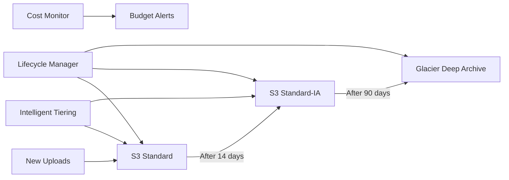
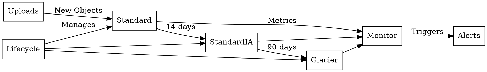

# AWS S3 Storage Optimization with Pulumi Python

## Project Overview

This repository contains Pulumi infrastructure as code (Python) for optimizing AWS S3 storage costs through automated lifecycle policies and cost monitoring.

## Key Features

- **Multi-Tier Storage Architecture**
  - Standard tier for newly uploaded objects
  - Standard-Infrequent Access (IA) tier after 14 days
  - Glacier Deep Archive for long-term retention
  - Intelligent Tiering for unpredictable access patterns

- **Automated Lifecycle Management**
  - Time-based transitions between storage classes
  - Configurable transition periods
  - Expiration policies for object cleanup

- **Cost Monitoring**
  - Daily storage cost tracking
  - Budget threshold alerts
  - Storage analytics dashboard

## Architecture Diagram



## Prerequisites

- Python 3.7+
- Pulumi CLI installed
- AWS credentials configured
- Pulumi stack configured

## Repository Structure

```
├── __main__.py            # Main Pulumi infrastructure
├── requirements.txt       # Python dependencies
├── Pulumi.yaml           # Pulumi project config
├── Pulumi.<stack>.yaml   # Environment config
├── docs/
│   ├── s3-lifecycle-diagram.png  
│   └── s3-lifecycle.dot          
├── modules/
│   ├── storage/          # S3 bucket configuration
│   │   ├── bucket.py     # Bucket definition
│   │   ├── lifecycle.py  # Transition policies
│   │   └── iam.py        # Access policies
│   └── monitoring/       # Cost tracking
└── scripts/              # Helper scripts
```

## Configuration

Set lifecycle transition days in your Pulumi config:

```bash
pulumi config set storage:standard_ia_days 14
pulumi config set storage:glacier_days 90
pulumi config set monitoring:budget_threshold 100
```

## Implementation Details

### Storage Module (`modules/storage`)
- `bucket.py`: Creates S3 bucket with versioning and logging
- `lifecycle.py`: Implements transition rules:
  ```python
  lifecycle_rules=[
      {
          "enabled": True,
          "transitions": [
              {
                  "days": config.standard_ia_days,
                  "storage_class": "STANDARD_IA"
              },
              {
                  "days": config.glacier_days,
                  "storage_class": "GLACIER"
              }
          ]
      }
  ]
  ```

### Monitoring Module (`modules/monitoring`)
- Tracks daily storage costs by class
- SNS alerts when thresholds exceeded
- Cost Explorer integration

## Generating Diagrams

To update the lifecycle diagram:

```bash
dot -Tpng docs/s3-lifecycle.dot -o docs/s3-lifecycle-diagram.png
```

Example `s3-lifecycle.dot`:


## Deployment

```bash
# Install dependencies
pip install -r requirements.txt

# Deploy infrastructure
pulumi up
```

## Monitoring Access

View storage metrics:
```bash
pulumi stack output dashboard_url
```