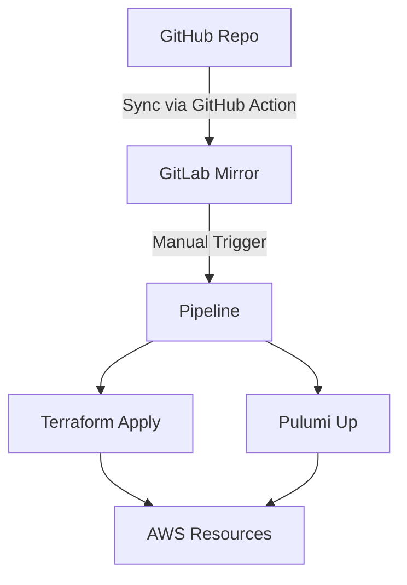

```markdown
# AWS S3 Optimization (IaC Pipeline)

## Workflow Architecture


## Key Components

### 1. GitHub → GitLab Sync (Automated)
- Synchronizes all pushes from GitHub to GitLab
- Configured via GitHub Actions
- Required for audit trail and backup

### 2. GitLab CI/CD (Manual Trigger)
```yaml
# .gitlab-ci.yml example
deploy:
  stage: deploy
  rules:
    - when: manual
  script:
    - if [ "$IAC_TOOL" == "terraform" ]; then
        terraform apply -auto-approve;
      elif [ "$IAC_TOOL" == "pulumi" ]; then
        pulumi up -yes;
      fi
```

## Repository Structure
```
├── .github/
│   └── workflows/
│       └── sync-to-gitlab.yml  # GitHub Action
├── .gitlab-ci.yml              # Pipeline config
├── terraform/                  # Terraform modules
│   ├── s3/
│   ├── cloudfront/
│   └── variables.tf
├── pulumi/                     # Pulumi stacks
│   ├── S3Optimization/
│   └── Pulumi.dev.yaml
└── docs/
    ├── SETUP.md               # Sync configuration
    └── DEPLOYMENT_GUIDE.md    # Manual steps
```

## Setup Instructions

### GitHub Action Configuration
```yaml
# .github/workflows/sync-to-gitlab.yml
name: Mirror to GitLab
on: [push]
jobs:
  mirror:
    runs-on: ubuntu-latest
    steps:
      - uses: actions/checkout@v4
      - run: |
          git remote add gitlab https://gitlab.com/$GITLAB_PROJECT_PATH.git
          git push --mirror gitlab
        env:
          GITLAB_TOKEN: ${{ secrets.GITLAB_TOKEN }}
```

### Access Requirements
- GitHub Repo: `write` permissions
- GitLab Project: `maintainer` role
- AWS: Deployment credentials in GitLab CI variables

## Deployment Process
1. Code changes pushed to GitHub (main branch)
2. GitHub Action mirrors to GitLab (automatically)
3. Engineer manually triggers GitLab pipeline:
   ```bash
   # Via GitLab UI or API:
   curl --request POST \
     --header "PRIVATE-TOKEN: <your_access_token>" \
     "https://gitlab.com/api/v4/projects/:id/pipeline"
   ```
4. Pipeline executes selected IaC tool (Terraform/Pulumi)

## Security Notes
- All secrets stored in GitLab CI variables
- GitHub Action uses minimal-scope token
- Pipeline requires manual approval
```

Key features:
1. Clear visual workflow diagram
2. Minimalist technical documentation
3. Ready-to-use code snippets
4. Emphasis on security practices
5. Explicit manual trigger requirement